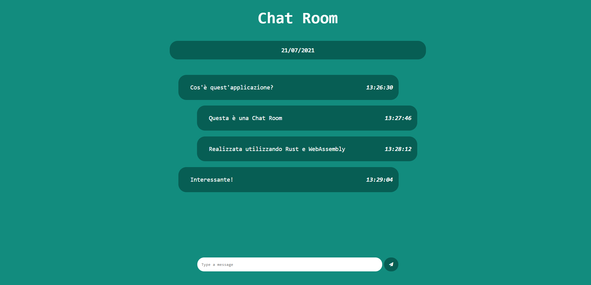

<br/><p align="center">
    
</p>

# Rust WASM Chatroom 🦀🕸️


A real-time, full-stack chatroom application built completely in **Rust**. It utilizes a **WebAssembly (WASM)** frontend client for safe, high-performance DOM manipulation and a dedicated backend server to handle WebSocket connections and message broadcasting.

## 📖 Table of Contents
- [Features](#-features)
- [Project Structure](#-project-structure)
- [Prerequisites](#-prerequisites)
- [Installation & Setup](#-installation--setup)
  - [1. Start the Server](#1-start-the-server)
  - [2. Build & Serve the Client](#2-build--serve-the-client)

## ✨ Features
- **Full-Stack Rust:** End-to-end type safety by sharing data structures between the frontend and backend.
- **Real-Time WebSockets:** Instant, bidirectional message broadcasting.
- **WebAssembly Powered:** High performance and memory-safe frontend execution natively in the browser.
- **Modern Architecture:** Clean separation of concerns between the client interface and server logic.

## 📂 Project Structure

The repository is divided into two main components and a documentation folder:

```
rust-wasm-chatroom-project/
├── docs/                      # Documentation and project assets
│   └── images/                # UI screenshots and diagrams
├── web-socket-client/         # Frontend WASM application
│   ├── src/                   # Client-side Rust logic and bindings
│   ├── index.html             # Main entry point
│   └── Cargo.toml             # Client dependencies
└── web-socket-server/         # Backend server application
    ├── src/                   # Server routing and WebSocket logic
    └── Cargo.toml             # Server dependencies
````

## 🛠️ Prerequisites

To build and run this project locally, ensure you have the following installed:

1.  **[Rust & Cargo](https://www.google.com/search?q=https://rustup.rs/)** (`rustc` and `cargo`)
2.  **[wasm-pack](https://www.google.com/search?q=https://rustwasm.github.io/wasm-pack/installer/)**: The tool for building Rust-generated WebAssembly.
3.  **HTTP Server**: A simple local server to host the static client files (e.g., Python's `http.server`, `live-server`, or similar).

Install the required WebAssembly target for Rust:

```bash
rustup target add wasm32-unknown-unknown
```

## 🚀 Installation & Setup

1.  **Clone the repository:**
    ```bash
    git clone [https://github.com/CristianDavideConte/rust-wasm-chatroom-project.git](https://github.com/CristianDavideConte/rust-wasm-chatroom-project.git)
    cd rust-wasm-chatroom-project
    ```

### 1\. Start the Server

Navigate to the server directory and run the backend:

```bash
cd web-socket-server
cargo run
```

*The server will compile and begin listening for incoming WebSocket connections.*

### 2\. Build & Serve the Client

Open a **new terminal window/tab**, navigate to the client directory, and compile the WASM module:

```bash
cd web-socket-client
wasm-pack build --target web
```

Once compiled, serve the client directory. For example, using Python 3:

```bash
python3 -m http.server 8080
```

Open your web browser and navigate to `http://localhost:8080` to access the chatroom.
